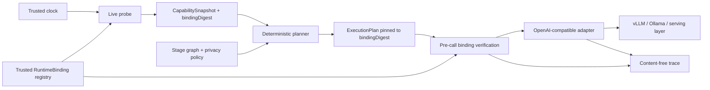

# ADR 0002: trusted live runtime bindings

- Status: accepted for `v0.2.0-alpha.1`
- Date: 2026-07-15
- Target release: StageFabric v0.2

## Context

StageFabric v0.1 proves deterministic, privacy-aware placement over a declared
capability snapshot, but its adapters and targets are simulated. The next useful
increment must prove that a plan can be executed against a real inference runtime
without turning StageFabric into another model server, inference scheduler, or
workflow API.

vLLM, Ollama, Ray Serve LLM, KServe, NVIDIA Dynamo, and llm-d already own model
loading, accelerator placement, batching, routing, autoscaling, cache management,
and distributed inference. Several expose an OpenAI-compatible HTTP surface.
StageFabric should remain the application-level placement and privacy layer above
those systems and reuse that common surface rather than reproduce their serving
logic.

Live endpoints and credentials introduce a stronger trust boundary than a static
stage graph. A graph may be supplied by an application author; it must not be able
to select an arbitrary URL, environment variable, model, wire operation, or output
field. Conversely, a SHA-256 digest on an externally supplied snapshot proves only
content integrity. It does not prove who created the snapshot or authorize a
network destination.

## Decision

### Product boundary

The Live Fabric Runner stays in this repository as a v0.2 bounded increment. It is
not a separate project. The existing deterministic planner, lineage rules, egress
proof, executor, and adapter ports remain the control plane.

StageFabric owns:

- application stage placement and privacy policy;
- a trusted registry of runtime bindings;
- live capability probing and snapshot construction;
- deterministic planning against the resulting snapshot;
- pre-call binding verification and bounded adapter execution;
- content-free execution evidence.

StageFabric does not own model serving or cluster scheduling. vLLM, Ollama, Ray
Serve LLM, KServe, Dynamo, llm-d, and comparable systems remain replaceable serving
layers behind an OpenAI-compatible endpoint.

### Runtime flow

The mandatory order is:

1. Resolve a `RuntimeBinding` from the trusted composition root.
2. Probe that binding using a trusted clock and hardened fetch boundary.
3. Seal a capability snapshot containing the binding's canonical
   `bindingDigest`.
4. Plan deterministically. The execution plan pins the digest used during
   placement.
5. Before stage execution begins, compare the immutable adapter registry digest
   with the digest pinned by the plan.
6. Reject a missing or changed binding before fetch; never silently re-plan.
7. Execute through an OpenAI-compatible provider adapter and validate the
   normalized output before publishing it to downstream stages.

### Trusted binding contract

`RuntimeBinding` is a deployment-owned configuration object, separate from the
untrusted or less-trusted `StageGraph`. It is registered only at the composition
root. A graph refers to a target and operation; it cannot carry connection data.
The CLI enforces the same boundary with a required, separately selected
`--bindings` file. It never reads runtime bindings from the graph bundle.

The binding makes these values declarative and replaceable:

| Concern    | Binding-owned value                                                     |
| ---------- | ----------------------------------------------------------------------- |
| Target     | Exact `targetId` and adapter kind                                       |
| Endpoint   | Exact base URL; the adapter owns fixed probe/operation paths            |
| Model      | Configured model identifier per supported operation                     |
| Operation  | Mapping from a stage operation name to `generate-text` or `embedding`   |
| Input      | Exact logical stage input name consumed by the operation                |
| Output     | Exact logical stage output name produced by the operation               |
| Limits     | Timeout, response bytes, and exact embedding dimensions within ceilings |
| Credential | Dedicated `STAGEFABRIC_*` environment reference, never the secret value |

Mappings are data, not code. They use strict identifiers and enumerated operation
kinds; arbitrary JSONPath, expressions, callbacks, module paths, dynamic imports,
or `eval` are forbidden. Provider-specific wire handling is delegated to the
maintained `@ai-sdk/openai-compatible` provider and AI SDK primitives.

The canonical binding digest includes every non-secret field that can change the
destination or semantics of a call, including base URL, model,
operation/input/output mappings, limits, and the credential reference. It never
includes a credential value.

The probe records derived evidence named `stagefabric.operation/<operation>` in
the successful model observation. The planner consumes it through a separate
operation-availability check, never through graph requirements, fabric
capabilities, or declassification authority. Public schemas reserve the prefix,
so a graph or binding cannot promote availability evidence into authority.

### Supported operations

v0.2 supports only:

- `generate-text`: one declared text input to one declared text output, using a
  non-streaming OpenAI-compatible generation request;
- `embedding`: one declared text input to one declared finite numeric vector
  output with the exact configured `expectedDimensions`.

No tools are supplied to the model. Tool calls, empty/non-text generation,
side-effect requests, unexpected output variants, wrong-sized or non-finite
embedding values, extra logical outputs, or missing outputs fail closed. The
adapter performs no autonomous retry (`maxRetries: 0`).
The existing executor may move to a separately planned fallback target only under
its pre-output rules; that is a new bounded attempt against a different placement,
not an adapter retry.

The alpha live runner rejects any graph declassification before probe or
inference. A configured capability and an untrusted model response cannot prove
that sensitive content was removed. Live declassification requires a future
trusted output-verification port; the generic core contract remains available to
hosts that already provide an equivalent control.

### Probe semantics

The probe performs a bounded read of the configured OpenAI-compatible models
endpoint and derives only the capabilities declared by the binding and actually
available for the configured model. Absence of the configured model makes that
target unavailable for its mapped operations. A subsequent deterministic plan
must therefore choose another eligible target or return `no_eligible_target`.

Probe time and expiry come from an injected trusted wall clock; request deadlines
use the host runtime's abort timer. The clock is read again after the probe, so a
snapshot that expires while discovery is running is rejected before planning. A
caller-supplied graph, snapshot, timestamp, response header, or remote body cannot
advance or extend freshness.

### Security boundary

All probe and inference calls use one hardened fetch implementation injected into
the OpenAI-compatible provider:

- HTTPS is mandatory. Plain HTTP is allowed only for `localhost` or literal
  loopback addresses (`127.0.0.0/8` or `[::1]`) intended for local Ollama/vLLM
  evaluation.
- The binding origin is parsed and validated once. Every constructed request must
  retain that exact origin and match an adapter-owned absolute-path allowlist.
- Allowed paths have no scheme, authority, query, fragment, backslash, or dot
  segment. Inputs never participate in URL construction.
- Redirect handling is `manual`; every `3xx` is rejected and never followed.
- Every request has an abort signal and a trusted-clock deadline.
- The response reader enforces a hard byte ceiling while consuming the body; a
  missing or dishonest `Content-Length` cannot bypass it.
- Probe, provider, and normalized operation results cross bounded schemas and
  size limits before they affect placement or stage values. The models probe
  projects only `data[].id` and discards non-authoritative provider metadata.
- Credentials are read only from a dedicated `STAGEFABRIC_*` environment
  variable at the trusted composition boundary. StageFabric never intentionally copies them into
  configuration files, plans, snapshots, traces, errors, or result envelopes.
  Model output remains application payload and must be handled as such.
- Traces use allowlisted reason codes and identifiers only. They contain no URL,
  origin, secret, prompt, completion, embedding, response body, or raw upstream
  error.
- A binding mismatch, malformed body, redirect, timeout, abort, oversized body,
  schema failure, or missing credential fails closed.

The live probe and planner are trusted together only when they run in the same
process with the same immutable binding registry. A snapshot received from a file,
API, cache, or another process is not authorized merely because its SHA-256 digest
matches. Authentic cross-process snapshots require a future signature and trust
policy.

### Exposure

v0.2 is a library/composition-root runner plus local or opt-in smoke entrypoint. It
does not add `POST /runs` or any equivalent remotely invokable execution endpoint.
Adding a network execution API would first require authentication, authorization,
tenant isolation, quotas, request provenance, and a separate threat review.

## Consequences and trade-offs

- The OpenAI-compatible common denominator avoids custom protocol clients and
  works across multiple serving products, but compatibility does not guarantee
  identical model semantics.
- Binding configuration remains portable, while deliberately bounded mappings
  are less flexible than arbitrary transformations.
- Same-process snapshot provenance gives a small trustworthy first slice, but it
  is not yet a distributed control plane.
- A models probe is useful placement evidence, not a guarantee that the next
  inference call will succeed.
- Zero adapter retries reduces duplicate work and ambiguous outcomes at the cost
  of lower transient-failure tolerance.
- Non-streaming generation makes response limits and exact output publication
  auditable. Streaming can be considered only with explicit partial-output and
  cancellation semantics.

## Non-goals

- model download, model lifecycle, tensor/model sharding, batching, GPU placement,
  autoscaling, KV-cache routing, prefill/decode disaggregation, or benchmarking;
- direct lifecycle control of Ray, KServe, Dynamo, llm-d, vLLM, or Ollama;
- tool calling, agent actions, side-effecting stages, arbitrary HTTP operations,
  multimodal requests, reranking, streaming, or batch inference;
- endpoint discovery from the graph, DNS-based service discovery, redirects, or
  provider-specific executable plugins;
- public remote execution, `POST /runs`, authentication, or multi-tenancy;
- accepting an external snapshot digest as proof of provenance;
- signed snapshots or a multi-process binding authority in v0.2.

## Reference implementations and serving layers

- [AI SDK OpenAI-compatible provider](https://ai-sdk.dev/providers/openai-compatible-providers)
- [vLLM OpenAI-compatible server](https://docs.vllm.ai/en/latest/serving/online_serving/openai_compatible_server/)
- [Ray Serve LLM](https://docs.ray.io/en/latest/serve/llm/index.html)
- [KServe generative inference runtime](https://kserve.github.io/website/docs/model-serving/generative-inference/overview)
- [NVIDIA Dynamo architecture and deployment posture](https://docs.nvidia.com/dynamo/getting-started/introduction)
- [llm-d distributed inference serving stack](https://github.com/llm-d/llm-d)
