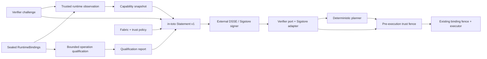

# ADR 0004: authenticate transported capability snapshots with in-toto and Sigstore

- Status: accepted
- Target: `v0.4.0-alpha.1`

## Context

The live runner currently probes, plans, and executes in one process. Its
capability snapshot and runtime bindings are immutable and digest-bound, which
is sufficient inside that trust boundary. The same digest is not provenance:
another process can construct different snapshot bytes, compute a valid digest,
and present the result to the planner.

StageFabric needs a transportable claim before a control plane can accept
observations from edge or workload-local probes. The claim must remain separate
from placement policy and execution authority, and it must reuse a reviewed
signing ecosystem rather than add application cryptography.

## Decision

StageFabric will define a narrow Capability Snapshot Attestation predicate over
in-toto Statement v1. An external DSSE/Sigstore signer produces the bundle.
StageFabric verifies it through an application port and ships one Node adapter
built on the official Sigstore JavaScript client.

The statement binds:

- canonical capability snapshot digest and validity interval;
- exact fabric digest;
- exact runtime-binding digest;
- qualified report and profile digests;
- exact trust-policy digest and deployment audience;
- digest of a verifier-generated 256-bit challenge;
- a target/operation scope digest and the fixed authority ceiling
  `placement-evidence-only`.

The snapshot, runtime bindings, and qualification report are distinct in-toto
subjects. The trust policy pins one literal certificate issuer and identity,
the exact audience, fabric, and qualification profile, and bounded freshness.
Caller input is never interpreted as a regular expression when matching
certificate identities.

Trusted planning wraps the ordinary deterministic plan with separate verified
evidence. The planner itself does not accept `trusted: true` or signature data.
Trusted execution verifies the same bundle again immediately before execution,
then relies on the existing plan, binding, and adapter-registry fences.

## Why in-toto Statement v1 and DSSE

in-toto gives the claim a typed predicate and digest-addressed subjects. DSSE
authenticates both payload type and payload bytes without inventing JSON-signing
rules. Sigstore supplies workload identity, transparency evidence, and trust-root
distribution. This composition is interoperable and keeps key lifecycle outside
StageFabric.

## Rejected alternatives

### Trust the existing SHA-256 digest

Rejected because integrity is not origin or authorization.

### Add an HMAC or Ed25519 implementation to StageFabric

Rejected because it would create key storage, rotation, revocation, algorithm,
and interoperability responsibilities unrelated to stage placement.

### Let a qualification report directly authorize planning

Rejected because qualification proves only the configured synthetic wire shape.
It is deliberately not a capability snapshot or authority source.

### Put signatures inside the capability snapshot schema

Rejected because it couples a platform-neutral core contract to one envelope
format and makes canonical hashing recursive. The signed statement remains a
separate evidence object.

### Accept signer regexes from configuration

Rejected because a permissive or malformed expression can silently widen the
trust domain. Policies store exact identities; adapters perform literal escaping.

## Consequences

- Cross-process planning and execution gain explicit identity and freshness
  checks without changing same-process behavior.
- A trusted runner needs a deployment-owned policy, a single-use challenge, the
  snapshot, its qualification report, and a Sigstore bundle.
- Sigstore verification adds TUF/trust-root I/O during verifier construction;
  one verifier instance should be reused for planning and the execution fence.
- A caller that needs strong replay prevention must issue and consume challenges
  atomically outside StageFabric.
- A valid signature still cannot prove model honesty, semantic quality, or
  ongoing availability; those remain runtime and application concerns.
