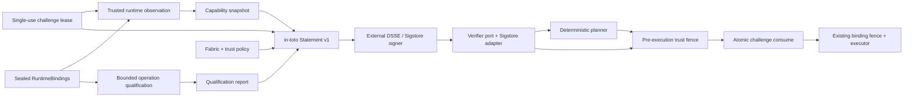

# ADR 0004: authenticate transported capability snapshots with in-toto and Sigstore

- Status: accepted and implemented
- Target: `v0.4.0-alpha.1`
- Date: 2026-07-17

## Context

The original live runner probes, plans, and executes in one process. Its
capability snapshot and runtime bindings are immutable and digest-bound, which
is sufficient inside that trust boundary. The same digest is not provenance:
another process can construct different snapshot bytes, compute a valid digest,
and present the result to the planner.

StageFabric needs a transportable claim before a control plane can accept
observations from edge or workload-local probes. The claim must remain separate
from placement policy and execution authority, and it must reuse a reviewed
signing ecosystem rather than add application cryptography.

## Decision

StageFabric defines a narrow Capability Snapshot Attestation predicate over
[in-toto Statement v1](https://github.com/in-toto/attestation/blob/main/spec/v1/statement.md).
An external DSSE/Sigstore signer produces the bundle. StageFabric verifies it
through an application port and ships one Node adapter built on the official
[Sigstore JavaScript client](https://github.com/sigstore/sigstore-js).



The statement binds:

- canonical capability snapshot digest and validity interval;
- exact fabric digest;
- exact runtime-binding digest;
- qualified report and profile digests;
- exact trust-policy digest and deployment audience;
- digest and trusted lease times of a verifier-generated 256-bit challenge;
- a target/operation scope digest and the fixed authority ceiling
  `placement-evidence-only`.

The qualification report is therefore an indirect prerequisite for this
authenticated application path. It proves only the bounded synthetic wire shape
named by its profile. Binding its digest does not let it add capabilities,
declassification authority, credential access, or execution permission.

The snapshot, runtime bindings, and qualification report are distinct in-toto
subjects named as canonical `*-content`, because their existing digests exclude
the sealed `digest` field and are not file-byte hashes. The trust policy pins
one literal certificate issuer and identity,
the exact audience, fabric, and qualification profile, and bounded freshness.
Caller input is never interpreted as a regular expression when matching
certificate identities.

Trusted planning wraps the ordinary deterministic plan with separate verified
evidence. The planner itself does not accept `trusted: true` or signature data.
Trusted execution verifies the same copied bundle bytes again immediately before
execution, atomically consumes the challenge through a deployment-owned port,
then relies on the existing plan, binding, and adapter-registry fences. The
reference file adapter is single-host only and burns the challenge before any
credential or provider work; clustered deployments must replace it with an
atomic shared store.

## Implemented operator workflow

The CLI exposes `qualify`, `trust-policy create`, `challenge issue`, `observe`,
`attestation-statement`, `plan-authenticated`, and `run-authenticated`. The
qualification report and derived trust policy are created before the short-lived
challenge. Observation occurs after challenge issuance. StageFabric writes the
canonical statement but never signs it. A compatible external invocation is:

```bash
pnpm dlx @sigstore/cli@0.10.1 attest statement.json \
  --payload-type application/vnd.in-toto+json \
  --tlog-upload \
  --output-file attestation.sigstore.json
```

The [official CLI](https://www.npmjs.com/package/@sigstore/cli) owns OIDC,
private-key use, Fulcio, and Rekor interaction. `trust-policy create` derives the
fabric and qualification-profile digests from replaceable inputs instead of
asking operators to hand-edit them.

`plan-authenticated` implements A8: it verifies once, plans from the same
canonical immutable snapshot, checks fabric/binding/snapshot context, and returns
the plan beside content-free trust evidence. It neither consumes the challenge
nor resolves credentials or invokes a provider.

`run-authenticated` implements A9: it copies and parses all evidence once,
verifies the bundle, plans, verifies the same copied bundle again with a fresh
clock reading, compares an authorization digest that excludes only `verifiedAt`,
rechecks the fabric/binding/planned-snapshot digests, then atomically consumes the
challenge before the existing provider path can read a credential or perform
I/O.

The file consumer records an exclusive marker named by challenge digest. Its
`--challenge-store` must be a stable private directory (`0700` on POSIX) reused
across runs. It is deliberately not a distributed replay service.

## Why in-toto Statement v1 and DSSE

in-toto gives the claim a typed predicate and digest-addressed subjects.
[DSSE](https://github.com/secure-systems-lab/dsse) authenticates both payload
type and payload bytes without inventing JSON-signing rules. Sigstore supplies
workload identity, transparency evidence, and trust-root distribution; its
[bundle format](https://docs.sigstore.dev/about/bundle/) carries verification
material and transparency-log evidence. This composition is interoperable and
keeps key lifecycle outside StageFabric.

## Rejected alternatives

### Trust the existing SHA-256 digest

Rejected because integrity is not origin or authorization.

### Add an HMAC or Ed25519 implementation to StageFabric

Rejected because it would create key storage, rotation, revocation, algorithm,
and interoperability responsibilities unrelated to stage placement.

### Let a qualification report directly authorize planning

Rejected because qualification proves only the configured synthetic wire shape.
It is deliberately not a capability snapshot or authority source.

### Put signatures inside the capability snapshot schema

Rejected because it couples a platform-neutral core contract to one envelope
format and makes canonical hashing recursive. The signed statement remains a
separate evidence object.

### Accept signer regexes from configuration

Rejected because a permissive or malformed expression can silently widen the
trust domain. Policies store exact identities; adapters perform literal escaping.

## Consequences

- Cross-process planning and execution gain explicit identity and freshness
  checks without changing same-process behavior.
- A trusted runner needs a deployment-owned policy, a single-use challenge, the
  snapshot, its qualification report, and a Sigstore bundle.
- Sigstore verification adds TUF/trust-root I/O during verifier construction;
  one verifier instance should be reused for planning and the execution fence.
- Signing remains an explicit external deployment step; StageFabric owns no
  private key or OIDC session.
- A caller that needs distributed replay prevention must replace the reference
  file consumer with a shared atomic challenge store.
- A valid signature still cannot prove model honesty, semantic quality, or
  ongoing availability; those remain runtime and application concerns.
