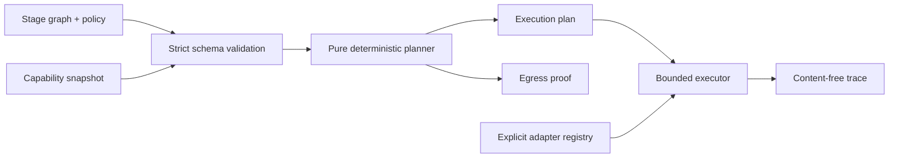
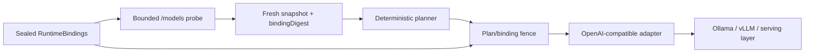

# Architecture

StageFabric is a modular monolith with a browser-safe deterministic core and a
thin Node.js composition layer.

The opt-in live path extends only the Node composition layer:

## Modules

- `domain`: core-neutral graph/snapshot schemas, immutable contracts, canonical
  hashing, classifications, and reason codes. The Node-only runtime-binding
  codec is excluded from `stagefabric/core` and owns the bounded provider kind.
- `application`: planning and execution use cases. Planning is pure; execution
  depends only on ports.
- `ports`: stage-adapter resolution and input-policy guard interfaces.
- `adapters`: configuration codecs, bounded network boundary, capability probe,
  in-process targets, and the OpenAI-compatible provider adapter.
- `entrypoints`: CLI and Hono HTTP API.
- `composition`: the only place where concrete adapters are registered.

Configuration contains adapter identifiers, never import paths. The composition
root maps those identifiers to code supplied by the host application.

`stagefabric/core` exports only domain, planner, executor, and port contracts.
The default and `stagefabric/node` entrypoints include Node configuration, CLI,
HTTP, demos, and live runtime composition.

## Planning algorithm

The planner validates and stable-topologically sorts the graph, then processes
each stage once. It derives the maximum classification of all incoming values and
selects targets that satisfy health, expiry, capabilities, zone, trust, residency,
and stage-specific constraints.

Candidates are ordered lexicographically by policy zone preference, integer p95
latency, integer cost, then Unicode code-point target identifier. This makes the
result reproducible and avoids unstable floating-point weights. The first target
is primary; the remainder are ordered fallbacks.

This is intentionally a deterministic greedy planner. Cross-stage global
optimization is deferred until it can preserve explainability and reproducibility.

## Data lineage and egress

Every value carries a classification. An output classification is at least the
maximum classification of its inputs. A lower classification requires an explicit
declassification declaration and a target with the named authority capability.

For each dependency whose selected target or zone changes, the plan includes an
egress record with source, destination, classification, and policy reason codes.
The executor consumes a previously validated plan; it does not silently re-plan.

For a binding-bound live snapshot, model discovery records namespaced evidence
for the exact configured operation. The planner checks that evidence as a
separate target-eligibility restriction; it is never inserted into the graph,
fabric, or declassification capability set. Public schemas reserve the namespace.
This prevents both shared-capability confusion and accidental use of availability
evidence as authority.

The generic core can plan explicit declassification for a host that owns a
trusted verifier. The alpha live runner has no output-verification port, so it
rejects every graph containing a declassification before network I/O.

## Extension points

Targets, zones, classifications, capabilities, operations, and adapter kinds are
arbitrary identifiers validated at the boundary. A production host can register
WebLLM, Transformers.js, Ollama, vLLM, Dynamo, or proprietary adapters without a
change to the planner.
