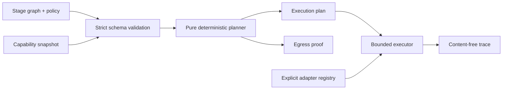
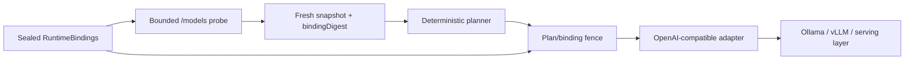
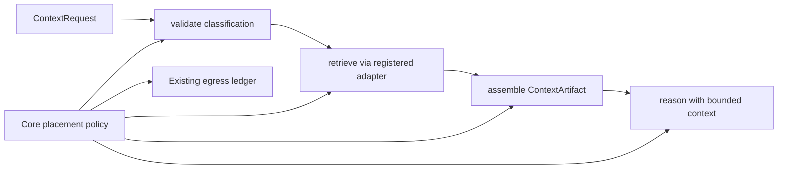
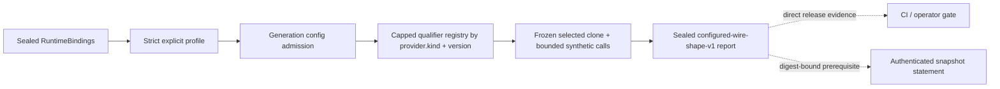
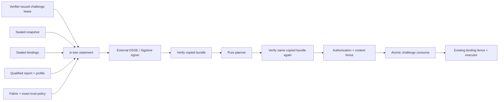

# Architecture

StageFabric is a modular monolith with a browser-safe deterministic core and a
thin Node.js composition layer.

The opt-in live path extends only the Node composition layer:

The Context Supply Chain reuses the same core for evidence selection and prompt
assembly without adding an index:

The optional PageIndex adapter is a Node composition adapter. The operator
injects a structurally compatible `client.tools` object and page selector; the
core has no PageIndex SDK, credential, endpoint, or import path. Operator
bindings pin source/index identity, classification, and freshness. A run-wide
deadline and aggregate call, response, structure, page, evidence, and logical
egress ceilings bound the complete multi-source workflow.

The assembled artifact is canonical and accounts only for the query/context
input and logical cross-stage payload. The final run receipt adds real reasoner
output accounting and binds it to the request, artifact, plan, and egress
digests. `logicalEgressBytes` is policy-bound payload accounting, not transport
wire telemetry.

Runtime qualification is a separate, opt-in evidence path:

There is intentionally no direct edge from a qualification report to the core
planner, capability snapshot, executor, or authority model. The authenticated
application path requires a qualified report as indirect compatibility evidence
and binds its digest into the signed statement. The report cannot add a target,
capability, declassification authority, or execution permission.

The report has no clock field. Its explicit qualification scope, a fixed producer
artifact, and trusted registration-supplied qualifier artifact are included in
its digest instead, preserving deterministic evidence while binding it to named
implementation semantics. Artifact versions do not establish provenance.

Async qualifier code never receives the evidence objects later used to construct
the report. The orchestrator retains a private primitive snapshot and gives the
port a separate recursively frozen target clone containing only admitted selected
operations.

Authenticated transport is another application/composition path around the same
planner and executor:

All evidence files and the bundle are loaded once. Fabric, bindings, snapshot,
report, profile, policy, and challenge are parsed into one recursively frozen
input projection before asynchronous verification. The signed statement is
decoded only after the verifier port authenticates its DSSE envelope. A stable
`authorizationDigest` binds every authorization-relevant digest, signer, audience,
and challenge lease while deliberately excluding the changing `verifiedAt`
timestamp.

`plan-authenticated` performs the first verification, compiles the plan from the
same immutable snapshot, checks the plan/fabric/binding context, and returns
separate content-free trust evidence. It does not consume the challenge, resolve
a credential, or contact a provider. `run-authenticated` repeats verification
after planning, compares the stable authorization digest, repeats the context
checks, and atomically consumes the challenge before the existing live executor
can construct a provider adapter. This implements requirements A8 and A9 without
adding signature fields or a trust flag to the core planner.

The reference file consumer uses an exclusive marker named by challenge digest
inside the operator-supplied `--challenge-store`. The directory must remain
stable across invocations and private (`0700` on POSIX). This provides same-host
replay memory; a distributed deployment replaces only the consumer port with a
shared atomic store.

## Modules

- `domain`: core-neutral graph/snapshot/runtime-binding schemas, typed contracts,
  canonical hashing, classifications, attestation statement semantics, trust
  policy, challenge, and reason codes. Runtime-binding and attestation domain
  contracts plus `ContextRequest`/`ContextArtifact` are available from
  `stagefabric/core`; Node YAML/file codecs are not.
- `application`: planning and execution use cases. Planning is pure; execution
  depends only on ports. Runtime qualification adds a bounded deterministic
  orchestrator. Snapshot authentication verifies signed-statement semantics and
  produces a stable, content-free authorization digest.
- `ports`: stage-adapter resolution, input-policy guard, post-output verifier,
  and provider-keyed runtime-operation qualifier interfaces, plus replaceable
  attestation-verifier and atomic challenge-consumer boundaries.
- `adapters`: configuration codecs, bounded network boundary, capability probe,
  in-process targets, OpenAI-compatible provider adapter, opt-in qualifier,
  bounded evidence-file loaders, official Sigstore verification, and a
  single-host file challenge consumer.
- `entrypoints`: CLI, authenticated local workflow, and Hono HTTP API.
- `composition`: the only place where concrete adapters are registered and the
  pre-execution trust fence is assembled.

The alpha `RuntimeBindings` provider schema currently admits only the
OpenAI-compatible wire kind. The qualifier port and report are provider-keyed,
but adding a non-OpenAI provider requires an explicit binding-schema and adapter
release; configuration cannot inject a new parser or executable module.

Configuration contains adapter identifiers, never import paths. The composition
root maps those identifiers to code supplied by the host application.

`stagefabric/core` exports only domain, planner, executor, and port contracts.
The default and `stagefabric/node` entrypoints include Node configuration, CLI,
HTTP, demos, and live runtime composition.

## Planning algorithm

The planner validates and stable-topologically sorts the graph, then processes
each stage once. It derives the maximum classification of all incoming values and
selects targets that satisfy health, expiry, capabilities, zone, trust, residency,
and stage-specific constraints.

Candidates are ordered lexicographically by policy zone preference, integer p95
latency, integer cost, then Unicode code-point target identifier. This makes the
result reproducible and avoids unstable floating-point weights. The first target
is primary; the remainder are ordered fallbacks.

This is intentionally a deterministic greedy planner. Cross-stage global
optimization is deferred until it can preserve explainability and reproducibility.

## Data lineage and egress

Every value carries a classification. An output classification is at least the
maximum classification of its inputs. A lower classification requires an
explicit declassification declaration, a target with the named authority
capability, and an execution-time `StageOutputVerifier` that returns exactly
`true` for the disposable output snapshot. Missing, failed, or rejected
verification fails closed.

For each dependency whose selected target or zone changes, the plan includes an
egress record with source, destination, classification, and policy reason codes.
The executor consumes a previously validated plan; it does not silently re-plan.
Caller inputs, stage inputs, adapter outputs, guard requests, and verifier
requests are bounded plain-data snapshots. Accessors, symbols, exotic
prototypes, cycles, and snapshot-limit overflow are rejected so an extension
cannot mutate another attempt or the caller's values.

For a binding-bound live snapshot, model discovery records namespaced evidence
for the exact configured operation. The planner checks that evidence as a
separate target-eligibility restriction; it is never inserted into the graph,
fabric, or declassification capability set. Public schemas reserve the namespace.
This prevents both shared-capability confusion and accidental use of availability
evidence as authority.

The generic core can plan explicit declassification for a host that owns a
trusted verifier. The alpha live runner has no output-verification port, so it
rejects every graph containing a declassification before network I/O.

## Extension points

Targets, zones, classifications, capabilities, operations, and adapter kinds are
arbitrary identifiers validated at the boundary. A production host can register
WebLLM, Transformers.js, Ollama, vLLM, Dynamo, or proprietary adapters without a
change to the planner.
