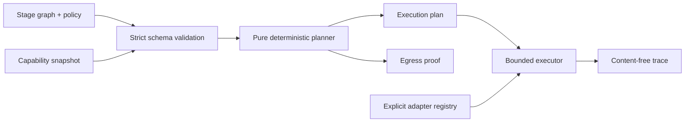

# Architecture

StageFabric is a modular monolith with a browser-safe deterministic core and a
thin Node.js composition layer.

## Modules

- `domain`: schemas, immutable contracts, graph validation, canonical hashing,
  classifications, and reason codes. It has no provider knowledge.
- `application`: planning and execution use cases. Planning is pure; execution
  depends only on ports.
- `ports`: adapter and clock interfaces.
- `adapters`: in-process demo targets and configuration codecs.
- `entrypoints`: CLI and Hono HTTP API.
- `composition`: the only place where concrete adapters are registered.

Configuration contains adapter identifiers, never import paths. The composition
root maps those identifiers to code supplied by the host application.

## Planning algorithm

The planner validates and stable-topologically sorts the graph, then processes
each stage once. It derives the maximum classification of all incoming values and
selects targets that satisfy health, expiry, capabilities, zone, trust, residency,
and stage-specific constraints.

Candidates are ordered lexicographically by policy zone preference, integer p95
latency, integer cost, then Unicode code-point target identifier. This makes the
result reproducible and avoids unstable floating-point weights. The first target
is primary; the remainder are ordered fallbacks.

This is intentionally a deterministic greedy planner. Cross-stage global
optimization is deferred until it can preserve explainability and reproducibility.

## Data lineage and egress

Every value carries a classification. An output classification is at least the
maximum classification of its inputs. A lower classification requires an explicit
declassification declaration and a target with the named authority capability.

For each dependency whose selected target or zone changes, the plan includes an
egress record with source, destination, classification, and policy reason codes.
The executor consumes a previously validated plan; it does not silently re-plan.

## Extension points

Targets, zones, classifications, capabilities, operations, and adapter kinds are
arbitrary identifiers validated at the boundary. A production host can register
WebLLM, Transformers.js, Ollama, vLLM, Dynamo, or proprietary adapters without a
change to the planner.
